# Hệ thống Quản lý & Cảnh báo Hết hạn Văn bản / SR

> **Phiên bản:** 1.3 — Draft (Miniproject Sinh viên — Microservices)
> **Ngày:** 2026-06-15 | **Cập nhật:** 2026-06-23
> **Tác giả:** *(điền tên nhóm)*
> **Thời gian thực hiện:** 3 tuần
> **Trạng thái:** Đang soạn thảo

---

## Changelog

| Version | Ngày | Thay đổi |
|---|---|---|
| **1.6** | 23/06/2026 | Chuyển cron logic vào notification-service (Option B): notification-service tự pull document-service + ghi `alert_queue` trong cùng schema → true outbox; scheduler-service thu gọn thành thin trigger proxy, không còn business logic |
| 1.5 | 23/06/2026 | Áp dụng Transactional Outbox Pattern: (1) `notification_outbox` trong document_schema — document-service viết cùng transaction khi đổi status, `OutboxRelayJob` @Scheduled(10s) relay sang notification-service; (2) `alert_queue` trong notification_schema — scheduler gọi REST nhanh (202), `AlertQueueProcessor` @Scheduled(30s) xử lý async; cập nhật Section 7, 8, ke-hoach, todo-list |
| 1.4 | 23/06/2026 | Thêm phân cấp tổ chức 3 tầng (Trung tâm < Công ty < Tập đoàn): mở rộng từ 3 role → 4 role (`USER`, `MANAGER_CENTER`, `MANAGER_COMPANY`, `ADMIN`); thêm field `level` vào documents (`CENTER`/`COMPANY`/`GROUP`); thêm bảng `companies`; cập nhật ma trận phân quyền, luồng alert, và data model theo 3 cấp |
| 1.3 | 23/06/2026 | Xử lý góp ý reviewer: Thu hẹp loại văn bản còn 4 loại; self-approval rule; `renewal_count`; ghi chú kiến trúc shared-DB; xác nhận ngưỡng max 30 ngày |
| 1.2 | 15/06/2026 | Draft ban đầu — phân rã 4 service, schema, API list |

---

## Mục lục

1. [Tổng quan nghiệp vụ](#1-tổng-quan-nghiệp-vụ)
2. [Phạm vi đề tài](#2-phạm-vi-đề-tài)
3. [Phân quyền & Vai trò](#3-phân-quyền--vai-trò)
4. [Luồng nghiệp vụ chính](#4-luồng-nghiệp-vụ-chính)
5. [Kiến trúc hệ thống](#5-kiến-trúc-hệ-thống)
6. [Bảng công nghệ](#6-bảng-công-nghệ)
7. [Mô hình dữ liệu](#7-mô-hình-dữ-liệu)
8. [Luồng cảnh báo tự động](#8-luồng-cảnh-báo-tự-động)
9. [Vòng đời trạng thái văn bản](#9-vòng-đời-trạng-thái-văn-bản)
10. [Khả năng mở rộng & tích hợp](#10-khả-năng-mở-rộng--tích-hợp)
11. [Kế hoạch 3 tuần](#11-kế-hoạch-3-tuần)
12. [Danh sách API](#12-danh-sách-api)

---

## 1. Tổng quan nghiệp vụ

| Khía cạnh | Mô tả |
|---|---|
| **Mục tiêu** | Quản lý danh sách văn bản / SR có ngày hết hạn; tự động gửi email cảnh báo trước khi hết hạn theo từng cấp |
| **Đối tượng sử dụng** | Nhân viên (USER) · Trưởng Trung tâm (MANAGER_CENTER) · Trưởng Công ty (MANAGER_COMPANY) · Quản trị Tập đoàn (ADMIN) |
| **Cấp văn bản** | **3 cấp:** Trung tâm (CENTER) · Công ty (COMPANY) · Tập đoàn (GROUP) |
| **Loại văn bản** | **4 loại:** Hợp đồng (CONTRACT) · Giấy phép (LICENSE) · Chứng chỉ (CERTIFICATE) · SR nội bộ (SR) |
| **Quy trình duyệt** | Nhân viên tạo → Manager cấp tương ứng duyệt → Kích hoạt theo dõi hết hạn. **Không tự duyệt văn bản của mình.** |
| **Quy tắc cảnh báo** | T-30/15 → User; T-7 → User + Manager cấp trực tiếp; T-1 → User + Manager cấp trực tiếp + cấp trên. **Max ngưỡng: 30 ngày** |
| **Kiến trúc** | Microservices cơ bản: 4 service độc lập, giao tiếp REST, triển khai Docker Compose |
| **Kênh thông báo** | Email (SMTP) — kênh duy nhất trong phạm vi đề tài |
| **Hành động sau cảnh báo** | Gia hạn, đánh dấu đã xử lý, hoặc hệ thống tự chuyển EXPIRED |

---

## 2. Phạm vi đề tài

### Trong phạm vi (In-scope)

| # | Tính năng |
|---|---|
| 1 | **Microservices**: 4 service riêng biệt — auth, document, notification, scheduler |
| 2 | **API Gateway** (Nginx): định tuyến request, forward JWT đến đúng service |
| 3 | Đăng ký / Đăng nhập, phân quyền **4 vai trò**: USER, MANAGER_CENTER, MANAGER_COMPANY, ADMIN |
| 4 | CRUD văn bản / SR: tạo, xem, sửa, xóa, lọc theo trạng thái — **4 loại**: CONTRACT, LICENSE, CERTIFICATE, SR; **3 cấp**: CENTER, COMPANY, GROUP |
| 5 | **Luồng duyệt theo cấp**: cấp nào của văn bản thì Manager cấp đó duyệt; không tự duyệt văn bản mình tạo |
| 6 | Upload file đính kèm (PDF / Word, lưu local disk) |
| 7 | Cài đặt ngưỡng cảnh báo theo loại văn bản (Admin) — **max 30 ngày** |
| 8 | Cron job hàng ngày: quét và gửi email **theo từng cấp** (T-30/15/7/1) |
| 9 | Dashboard: thống kê tổng hợp, danh sách sắp hết hạn (lọc theo phòng) |
| 10 | Lịch sử cảnh báo đã gửi (alert log) |
| 11 | Gia hạn văn bản — cập nhật tại chỗ + ghi log `RENEW` vào `approval_requests` |

### Ngoài phạm vi (Out-of-scope) — Hướng phát triển tiếp theo

| Tính năng | Lý do loại khỏi scope |
|---|---|
| SMS / Push notification | Phức tạp, tốn phí API |
| Tích hợp ERP / DMS / JIRA | Không có môi trường test |
| SSO / Active Directory | Overkill cho demo sinh viên |
| Mobile app | Cần thêm 2–3 tuần riêng |
| Message queue (Kafka/RabbitMQ) | Thay bằng REST đồng bộ cho đơn giản |
| Service mesh / Distributed tracing | Quá phức tạp cho 3 tuần |
| Luồng duyệt 3+ cấp | Có thể mở rộng sau khi hoàn thành luồng 2 cấp |

---

## 3. Phân quyền & Vai trò

### 3.1 Cấu trúc tổ chức 3 tầng

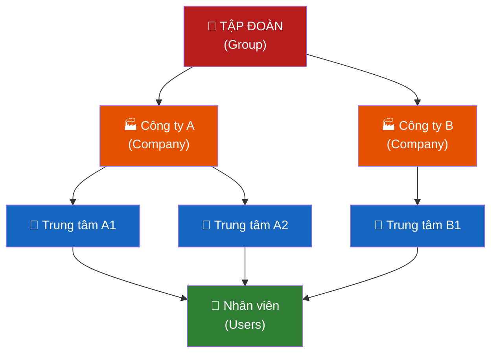

### 3.2 Mô tả các vai trò

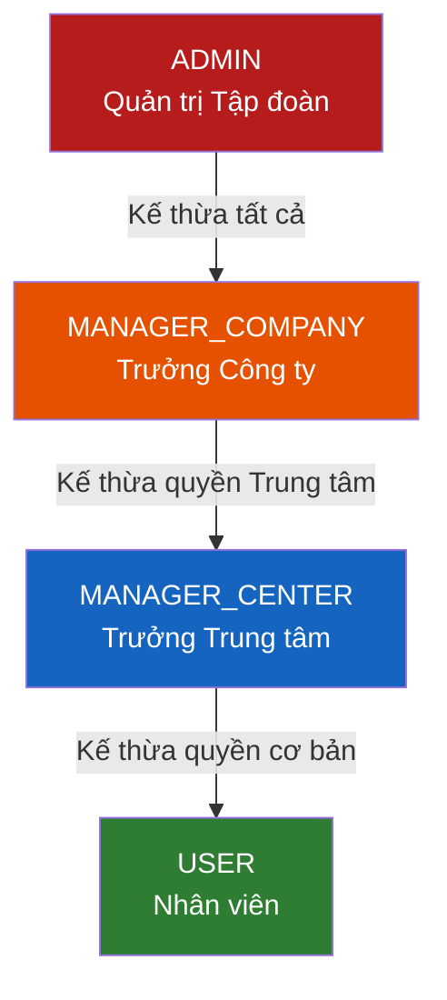

| Vai trò | Mã | Phạm vi | Thuộc về | Nhận cảnh báo |
|---|---|---|---|---|
| **ADMIN** | `ADMIN` | Toàn Tập đoàn | Tập đoàn (không gắn Công ty hay Trung tâm) | T-1 mọi văn bản + toàn bộ GROUP-level |
| **MANAGER_COMPANY** | `MANAGER_COMPANY` | Công ty | Một Công ty (`company_id`) | T-7, T-1 (văn bản Công ty mình + Trung tâm trực thuộc) |
| **MANAGER_CENTER** | `MANAGER_CENTER` | Trung tâm | Một Trung tâm (`department_id`) thuộc Công ty | T-7, T-1 (văn bản Trung tâm mình) |
| **USER** | `USER` | Cá nhân | Một Trung tâm (`department_id`) | T-30, T-15, T-7, T-1 (văn bản của mình) |

### 3.3 Cấp văn bản và quyền duyệt

Mỗi văn bản có field `level` xác định tầm quan trọng và ai có quyền duyệt:

| Cấp văn bản | `level` | Ai có thể duyệt | Ví dụ |
|---|---|---|---|
| **Cấp Trung tâm** | `CENTER` | MANAGER_CENTER (cùng Trung tâm), MANAGER_COMPANY (cùng Công ty), ADMIN | Quy trình nội bộ Trung tâm, SR nội bộ |
| **Cấp Công ty** | `COMPANY` | MANAGER_COMPANY (cùng Công ty), ADMIN | Hợp đồng Công ty, Giấy phép hoạt động |
| **Cấp Tập đoàn** | `GROUP` | ADMIN duy nhất | Văn bản chiến lược, chứng chỉ toàn Tập đoàn |

> **Rule self-approval:** Không role nào được tự duyệt văn bản do chính mình tạo ra — phải nhờ cấp trên một bậc xử lý.

### 3.4 Ma trận phân quyền chi tiết

| Hành động | USER | MANAGER_CENTER | MANAGER_COMPANY | ADMIN |
|---|:---:|:---:|:---:|:---:|
| **Văn bản — Xem** | | | | |
| Xem văn bản của mình | ✅ | ✅ | ✅ | ✅ |
| Xem văn bản Trung tâm mình | ❌ | ✅ | ✅ (Công ty mình) | ✅ |
| Xem văn bản Công ty mình | ❌ | ❌ | ✅ | ✅ |
| Xem tất cả | ❌ | ❌ | ❌ | ✅ |
| **Văn bản — Tạo/Sửa** | | | | |
| Tạo văn bản (bất kỳ cấp) | ✅ | ✅ | ✅ | ✅ |
| Sửa DRAFT của mình | ✅ | ✅ | ✅ | ✅ |
| Sửa DRAFT của người khác | ❌ | ✅ TT mình | ✅ CT mình | ✅ |
| Xóa văn bản DRAFT | ❌ | ✅ TT mình | ✅ CT mình | ✅ |
| Upload file đính kèm | ✅ | ✅ | ✅ | ✅ |
| **Luồng duyệt** | | | | |
| Nộp duyệt (DRAFT → PENDING) | ✅ | ✅ | ✅ | ✅ |
| Duyệt văn bản **CENTER** | ❌ | ✅ TT mình* | ✅ CT mình | ✅ |
| Duyệt văn bản **COMPANY** | ❌ | ❌ | ✅ CT mình* | ✅ |
| Duyệt văn bản **GROUP** | ❌ | ❌ | ❌ | ✅* |
| Từ chối văn bản | ❌ | ✅ (CENTER) | ✅ (CENTER+COMPANY) | ✅ |
| Gia hạn văn bản | ✅ mình | ✅ TT mình | ✅ CT mình | ✅ |
| Thu hồi (→ CANCELLED) | ❌ | ✅ TT mình | ✅ CT mình | ✅ |
| **Cảnh báo** | | | | |
| Xem alert log | Của mình | TT mình | CT mình | Tất cả |
| Cấu hình ngưỡng | ❌ | ❌ | ❌ | ✅ |
| **Hệ thống** | | | | |
| Quản lý người dùng | ❌ | ❌ | ❌ | ✅ |
| Quản lý Trung tâm / Công ty | ❌ | ❌ | ❌ | ✅ |
| Dashboard Trung tâm | ✅ | ✅ | ✅ | ✅ |
| Dashboard Công ty | ❌ | ❌ | ✅ | ✅ |
| Dashboard Tập đoàn | ❌ | ❌ | ❌ | ✅ |

> *\* Trừ văn bản do chính mình tạo ra (self-approval rule).*

### 3.5 Quy tắc lọc văn bản theo vai trò

| Role | Thấy văn bản nào | Điều kiện SQL |
|---|---|---|
| **USER** | Chỉ văn bản mình tạo | `owner_id = :userId` |
| **MANAGER_CENTER** | Tất cả văn bản Trung tâm mình (mọi cấp) | `department_id = :deptId` |
| **MANAGER_COMPANY** | Tất cả văn bản trong Công ty mình (qua join departments.company_id) | `company_id = :companyId` |
| **ADMIN** | Tất cả, không lọc | *(no filter)* |

> **"Văn bản hiện hành":** `status IN ('ACTIVE', 'WARNING')`. Các trạng thái EXPIRED/CANCELLED vẫn lưu để tra cứu lịch sử, không tham gia cron alert.

### 3.6 Phân cấp cảnh báo theo `level` văn bản

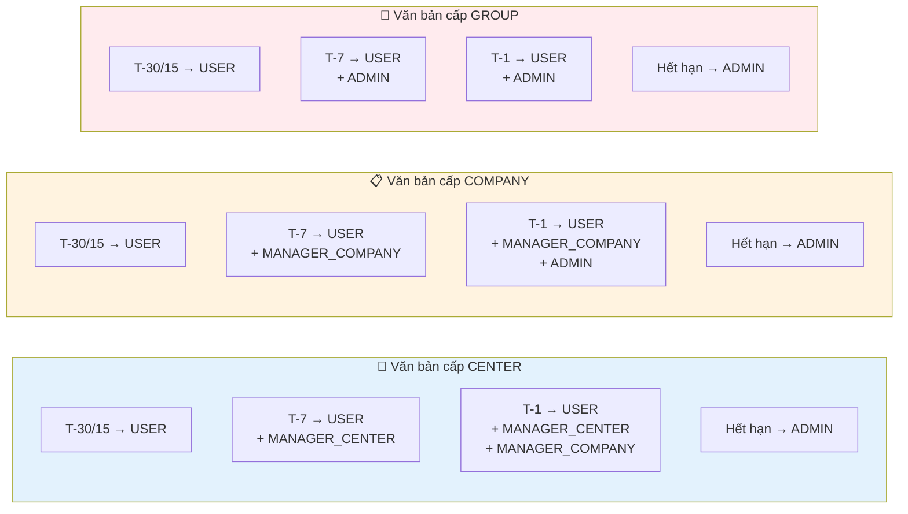

| Level | T-30 / T-15 | T-7 | T-1 | Expired |
|---|---|---|---|---|
| **CENTER** | USER (owner) | + MANAGER_CENTER | + MANAGER_COMPANY | ADMIN |
| **COMPANY** | USER (owner) | + MANAGER_COMPANY | + ADMIN | ADMIN |
| **GROUP** | USER (owner) | + ADMIN | + ADMIN | ADMIN |

---

## 4. Luồng nghiệp vụ chính

### 4.1 Luồng tạo và duyệt văn bản

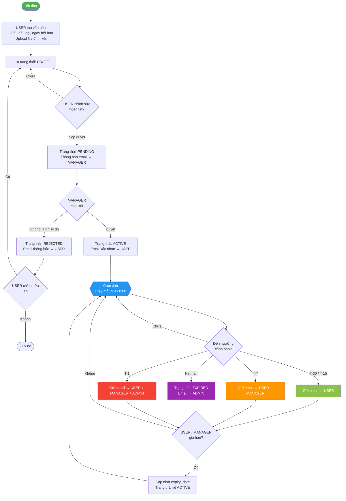

### 4.2 Luồng duyệt văn bản (chi tiết theo vai trò)

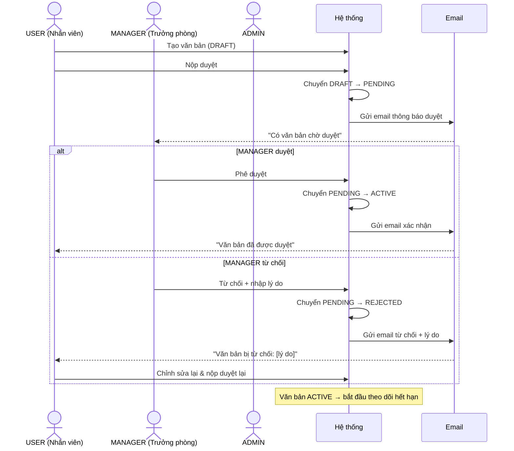

---

## 5. Kiến trúc hệ thống

### 5.1 Tổng quan Microservices

> Hệ thống tách thành **4 service độc lập**, mỗi service có database schema riêng, giao tiếp với nhau qua REST HTTP. Nginx đóng vai API Gateway định tuyến request từ frontend.

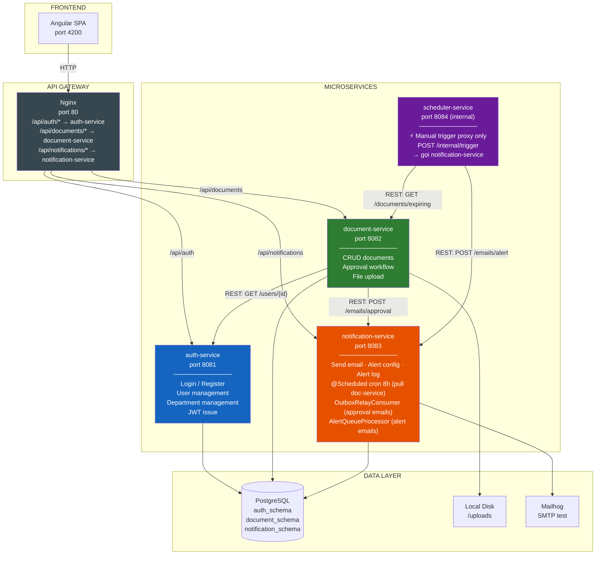

### 5.2 Phân rã service — trách nhiệm và sở hữu dữ liệu

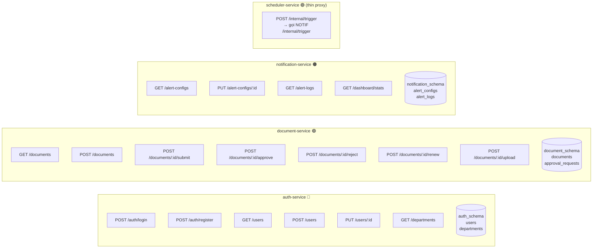

### 5.3 Giao tiếp giữa các service

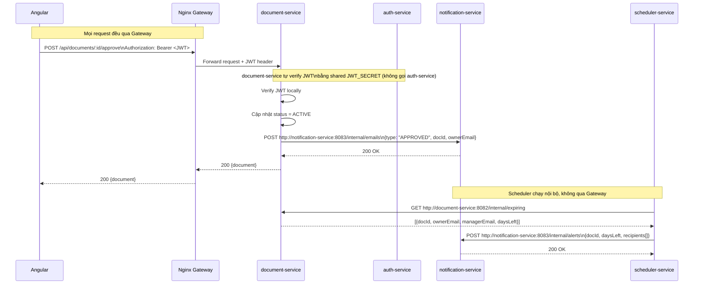

### 5.4 Ghi chú kiến trúc — Shared Database vs. True Microservices

> **Phản hồi reviewer:** *"Nếu micro thì cần thận làm có chia độc lập ko, có thì nên thế nào, ko thì thế nào."*

Thiết kế hiện tại là **"Shared Database, Schema per Service"** — một mẫu thực dụng cho miniproject, **không phải** true microservices hoàn chỉnh. Cần hiểu rõ sự khác biệt:

| Tiêu chí | Thiết kế hiện tại (v1.0) | True Microservices (hướng tới) |
|---|---|---|
| **Database** | 1 PostgreSQL instance, 3 schema riêng | Mỗi service có PostgreSQL **riêng** |
| **Isolation** | Schema-level (không dùng FK chéo schema) | Process-level + Network-level |
| **Giao tiếp** | REST đồng bộ (document-service → auth-service) | Event-driven (Kafka/RabbitMQ) |
| **Deploy độc lập** | Có thể, nhưng share DB là điểm nghẽn | Hoàn toàn độc lập |
| **Phù hợp với** | Demo 3 tuần, team 1 người | Production, team lớn |

**Lý do chọn shared-DB cho miniproject:**
- Đơn giản hóa việc setup Docker Compose
- Không cần implement event sourcing (phức tạp)
- Flyway migration dễ quản lý hơn khi cùng instance
- Mục tiêu là demo nghiệp vụ, không phải production-grade

**Điểm cần chú ý trong báo cáo:** Phải giải thích rõ đây là quyết định có chủ đích, không phải thiếu hiểu biết về microservices. Trình bày lộ trình v2.0 (tách DB + async) để chứng minh hiểu bài toán.

**Ràng buộc quan trọng:** Dù share cùng PostgreSQL instance, **các service KHÔNG được query trực tiếp schema của service khác**. document-service muốn lấy thông tin user phải gọi `GET /internal/users/{id}` của auth-service — không được `JOIN` chéo schema trong SQL.

### 5.5 Sơ đồ triển khai — Docker Compose

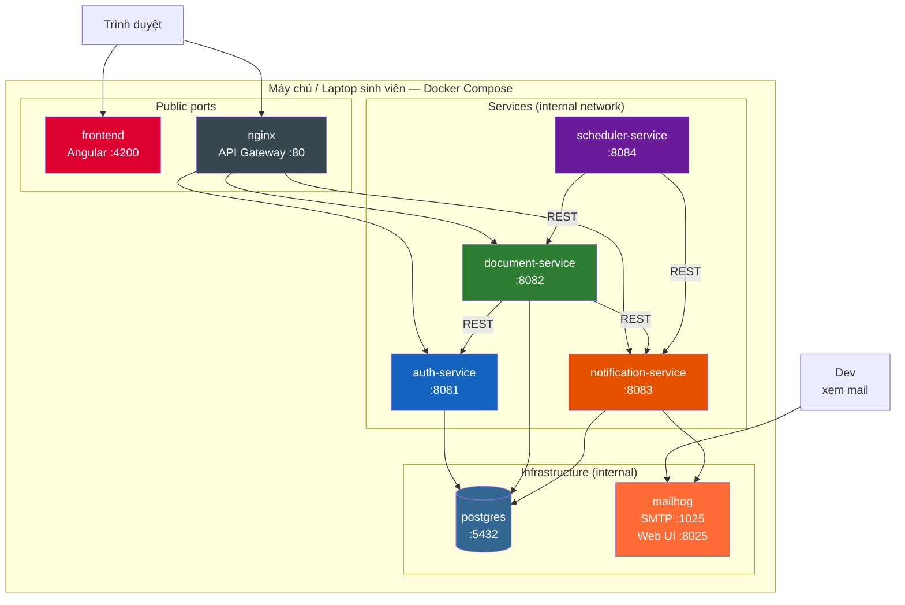

---

## 6. Bảng công nghệ

| Tầng | Thành phần | Công nghệ | Ghi chú |
|---|---|---|---|
| **Frontend** | Web SPA | Angular 17+ + Angular Material | Built-in module system, phù hợp enterprise |
| **Frontend** | HTTP Client | Angular HttpClient + Interceptor | Tự động gắn JWT, handle 401/403 |
| **Frontend** | Router | Angular Router + `CanActivate` | Guard route theo role |
| **API Gateway** | Reverse proxy | Nginx | Định tuyến request theo path prefix đến đúng service |
| **auth-service** | REST API + Auth | Spring Boot 3 + Spring Security + JWT | Phát hành JWT, validate role; shared `JWT_SECRET` với các service khác |
| **document-service** | REST API | Spring Boot 3 | Verify JWT cục bộ bằng shared secret, gọi notification-service qua REST |
| **notification-service** | REST API + Email | Spring Boot 3 + Spring Mail | Nhận request từ document-service và scheduler-service, gửi email qua SMTP |
| **scheduler-service** | Cron | Spring Boot 3 + `@Scheduled` | Gọi document-service lấy danh sách, gọi notification-service gửi alert |
| **Database** | Chính | PostgreSQL 15 — 3 schema riêng | `auth_schema`, `document_schema`, `notification_schema` trong cùng 1 instance |
| **Database** | Migration | Flyway (mỗi service tự migrate schema của mình) | Init schema khi service khởi động |
| **File Storage** | Upload | Local disk `/uploads` (mount volume Docker) | Không cần S3 cho demo |
| **Email test** | Dev mail | Mailhog | Bắt SMTP local, xem qua web UI port 8025 |
| **Container** | Orchestration | Docker + Docker Compose | 7 container, 1 internal network `app-network` |

### Cấu hình Nginx routing (minh hoạ)

```nginx
# nginx.conf
location /api/auth/ {
    proxy_pass http://auth-service:8081/;
}
location /api/documents/ {
    proxy_pass http://document-service:8082/;
}
location /api/notifications/ {
    proxy_pass http://notification-service:8083/;
}
```

---

## 7. Mô hình dữ liệu

> Mỗi service sở hữu schema riêng trong cùng một PostgreSQL instance. Service không truy cập trực tiếp vào schema của service khác — phải gọi qua REST API.

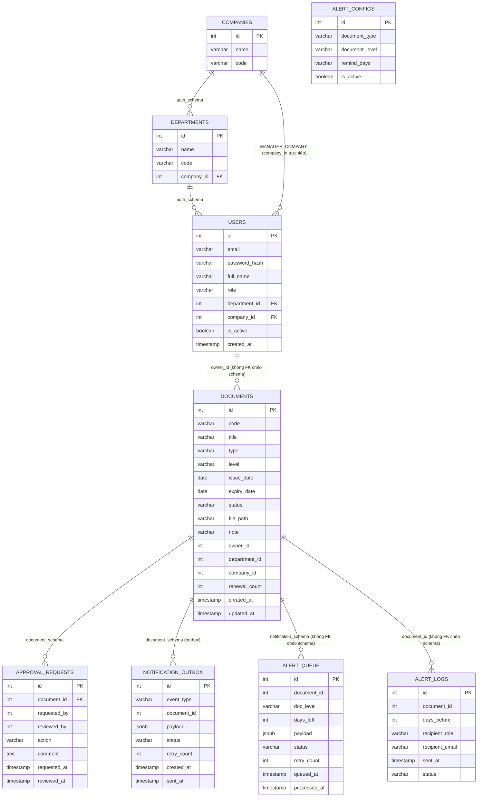

### Ghi chú thiết kế

| Bảng | Service sở hữu | Điểm chú ý |
|---|---|---|
| `companies` | auth-service | Đơn vị cấp Công ty. Seed ít nhất 1 công ty mặc định |
| `departments` | auth-service | Trung tâm — có `company_id` FK sang `companies`. `role` CHECK: `ADMIN`/`MANAGER_COMPANY`/`MANAGER_CENTER`/`USER` |
| `users` | auth-service | `department_id`: bắt buộc với USER và MANAGER_CENTER. `company_id`: bắt buộc với MANAGER_COMPANY. ADMIN: cả hai NULL |
| `documents` | document-service | Thêm `level` CHECK(`CENTER`,`COMPANY`,`GROUP`). Thêm `company_id` (lấy từ JWT claim khi tạo). `renewal_count` tăng mỗi lần gia hạn |
| `approval_requests` | document-service | `action` = `SUBMIT`/`APPROVE`/`REJECT`/`RENEW`/`CANCEL`; toàn bộ lịch sử |
| `notification_outbox` | document-service | **Outbox table.** `event_type` = `APPROVAL_REQUEST`/`APPROVED`/`REJECTED`. `payload` JSON chứa đủ thông tin để notification-service gửi mail (không cần query thêm). `status` = `PENDING`→`SENT`/`FAILED`. Max 3 lần retry |
| `alert_queue` | notification-service | **Inbox/Queue table.** Scheduler ghi vào đây qua REST (202 Accepted). `AlertQueueProcessor` xử lý async mỗi 30s. Dedup với `alert_logs` vẫn giữ nguyên |
| `alert_configs` | notification-service | Thêm `document_level` để cấu hình ngưỡng riêng theo cấp. Default `"30,15,7,1"` cho tất cả |
| `alert_logs` | notification-service | `document_id` lưu ID tham chiếu, **không FK** chéo schema; check trùng trước khi gửi |

**Nullable rules cho `users`:**

| Role | `department_id` | `company_id` |
|---|---|---|
| USER | ✅ Bắt buộc (Trung tâm thuộc về) | ❌ NULL (lấy qua departments.company_id) |
| MANAGER_CENTER | ✅ Bắt buộc (Trung tâm quản lý) | ❌ NULL (lấy qua departments.company_id) |
| MANAGER_COMPANY | ❌ NULL | ✅ Bắt buộc (Công ty quản lý) |
| ADMIN | ❌ NULL | ❌ NULL |

**Về gia hạn:** cập nhật tại chỗ (`expiry_date` mới + `renewal_count++`) + ghi log `RENEW` vào `approval_requests`.

> **Lý do không dùng Foreign Key chéo schema:** Mỗi service là đơn vị độc lập — nếu dùng FK chéo schema thì việc migrate, tách, hoặc scale riêng service sẽ không thực hiện được.

---

## 8. Luồng thông báo — Outbox Pattern

Hệ thống có **2 flow thông báo** áp dụng outbox pattern theo cách khác nhau do đặc thù của từng flow:

| | Flow 1 — Approval | Flow 2 — Alert (Cron) |
|---|---|---|
| **Trigger** | Đổi status văn bản | Cron job hàng ngày |
| **Outbox nằm ở** | `document_schema.notification_outbox` | `notification_schema.alert_queue` |
| **Relay/Processor** | `OutboxRelayJob` trong document-service | `AlertQueueProcessor` trong notification-service |
| **Lý do tách** | document-service sở hữu event, phải atomic với transaction | notification-service sở hữu queue, scheduler chỉ enqueue |

---

### 8.1 Flow 1 — Approval Notification (Outbox trong document-service)

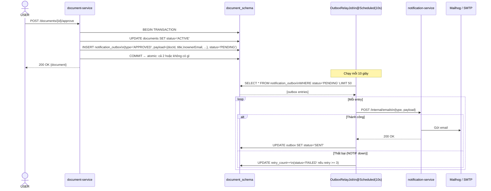

**Điểm cốt lõi:** Nếu notification-service down, `UPDATE documents` vẫn commit thành công. Outbox entry chờ relay retry. Không mất event, không rollback nghiệp vụ.

---

### 8.2 Flow 2 — Alert Notification (notification-service tự pull + true outbox)

> **Thay đổi v1.6:** notification-service tự sở hữu cron logic. Không còn phụ thuộc scheduler push vào — notification-service pull document-service và ghi thẳng vào `alert_queue` trong cùng schema → true outbox. scheduler-service chỉ là proxy cho manual trigger.

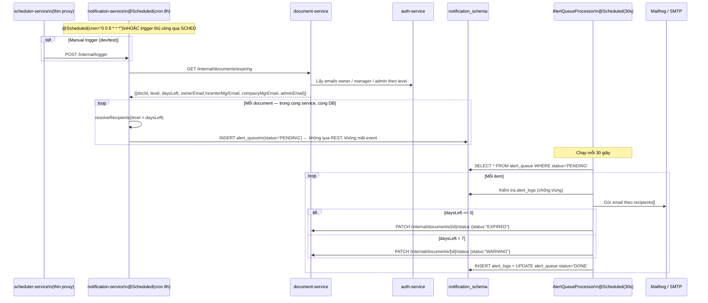

**Điểm cốt lõi:** notification-service ghi vào `alert_queue` mà không qua REST → không có cửa sổ mất event. Nếu document-service down lúc 8h, chỉ fail bước pull (có thể retry); nếu SMTP down, `AlertQueueProcessor` retry sau 30s.

---

### 8.3 Logic resolve recipients (giữ nguyên)

```java
private List<RecipientInfo> resolveRecipients(ExpiringDocDto doc, long daysLeft) {
    List<RecipientInfo> recipients = new ArrayList<>();
    recipients.add(doc.getOwner());

    switch (doc.getLevel()) {
        case "CENTER" -> {
            if (daysLeft <= 7)  recipients.add(doc.getCenterManager());
            if (daysLeft <= 1)  recipients.add(doc.getCompanyManager());
        }
        case "COMPANY" -> {
            if (daysLeft <= 7)  recipients.add(doc.getCompanyManager());
            if (daysLeft <= 1)  recipients.add(doc.getAdmin());
        }
        case "GROUP" -> {
            if (daysLeft <= 7)  recipients.add(doc.getAdmin());
        }
    }
    if (daysLeft <= 0) {
        recipients.clear();
        recipients.add(doc.getAdmin());
    }
    return recipients;
}
```

---

## 9. Vòng đời trạng thái văn bản

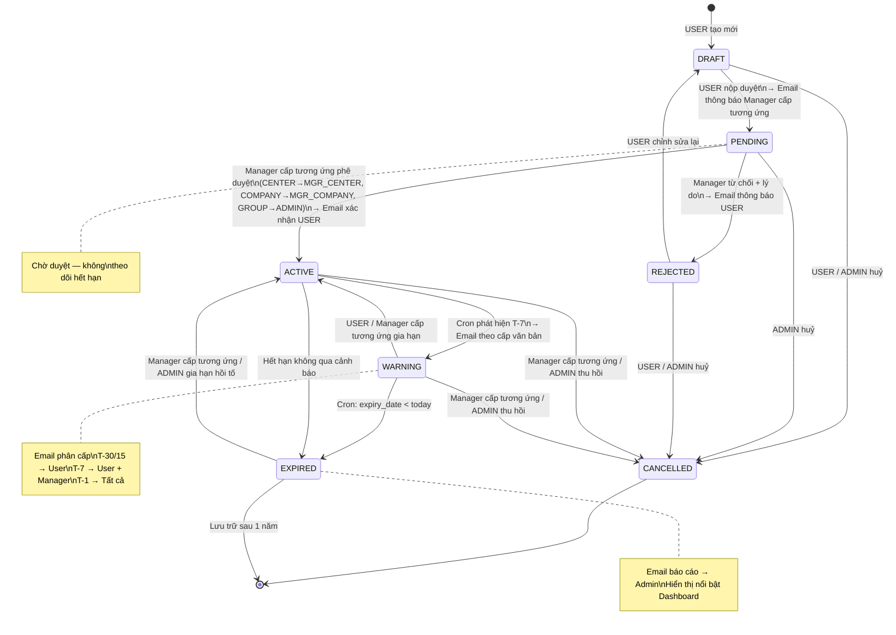

---

## 10. Khả năng mở rộng & tích hợp

### 10.1 Lộ trình mở rộng kiến trúc

```mermaid
graph LR
    subgraph V1["v1.0 — Miniproject\n3 tuần"]
        direction TB
        A1[4 Microservices\nSpring Boot]
        A2[(PostgreSQL\n3 schema)]
        A3[Docker Compose]
        A4[REST sync\ninter-service]
        A5[Luồng duyệt 2 cấp]
    end

    subgraph V2["v2.0 — Nâng cấp"]
        direction TB
        B1[Thêm RabbitMQ\nasync events]
        B2[Thêm SMS / Zalo OA]
        B3[Luồng duyệt N cấp]
        B4[Deploy VPS / Cloud]
    end

    subgraph V3["v3.0 — Production"]
        direction TB
        C1[Kubernetes\nHPA auto-scale]
        C2[Kafka event bus]
        C3[CI/CD Pipeline]
        C4[Tích hợp ERP / AD]
    end

    V1 -->|Thay REST bằng async| V2 -->|Scale up| V3
```

### 10.2 Các tích hợp có thể bổ sung sau

| Hệ thống | Phương thức | Mục đích | Độ ưu tiên |
|---|---|---|---|
| **Zalo OA** | Zalo API | Thay / bổ sung kênh email | Cao |
| **Google / Microsoft SSO** | OAuth2 | Đăng nhập tiện hơn | Trung bình |
| **Webhook generic** | HTTP POST | Tích hợp hệ thống nội bộ | Trung bình |
| **SMS (ESMS/FPT)** | REST API | Cảnh báo khẩn T-1 | Thấp |
| **Active Directory** | LDAP Sync | Đồng bộ user/phòng ban | Thấp |

---

## 11. Kế hoạch 3 tuần

```mermaid
gantt
    title Kế hoạch Miniproject — Quản lý Hết hạn Văn bản (Microservices)
    dateFormat  YYYY-MM-DD
    axisFormat  %d/%m

    section Tuần 1 — Hạ tầng & Auth
    Thiết kế schema, phân rã service       :done, t1a, 2026-06-15, 1d
    Docker Compose + Nginx config          :t1b, 2026-06-15, 2d
    auth-service: login/register/JWT       :t1c, 2026-06-16, 2d
    auth-service: user & department API    :t1d, 2026-06-18, 1d
    Frontend Angular: setup + login        :t1e, 2026-06-16, 3d
    Frontend: HTTP interceptor + JWT guard :t1f, 2026-06-19, 1d

    section Tuần 2 — Document & Notification
    document-service: CRUD + upload        :t2a, 2026-06-22, 2d
    document-service: approval workflow    :t2b, 2026-06-23, 2d
    notification-service: email + config   :t2c, 2026-06-22, 2d
    scheduler-service: cron + REST calls   :t2d, 2026-06-25, 2d
    Frontend: document list, form, duyệt   :t2e, 2026-06-22, 4d
    Frontend: alert log UI                 :t2f, 2026-06-26, 1d

    section Tuần 3 — Hoàn thiện
    Dashboard thống kê theo role           :t3a, 2026-06-29, 2d
    Gia hạn + thu hồi văn bản              :t3b, 2026-06-29, 1d
    Kiểm thử inter-service + fix bug       :t3c, 2026-07-01, 2d
    Viết báo cáo + slide demo              :t3d, 2026-07-03, 2d
    Demo & nộp bài                         :milestone, 2026-07-05, 0d
```

### Phân chia công việc gợi ý (nhóm 3–4 người)

| Vai trò | Tuần 1 | Tuần 2 | Tuần 3 |
|---|---|---|---|
| **Backend dev 1** | auth-service (login, JWT, user, dept) | document-service (CRUD, upload, approval) | Gia hạn, inter-service test, fix bug |
| **Backend dev 2** | Docker Compose + Nginx routing | notification-service (email, alert config, log) + scheduler-service | Dashboard API, deploy |
| **Frontend dev** | Angular setup, login, JWT interceptor, route guard | Document list, form tạo/sửa, luồng duyệt Manager | Dashboard, alert log, UI polish |
| **Lead / Fullstack** | Thiết kế schema, phân rã service, review | Kết nối các service, test Postman end-to-end | Báo cáo, slide, chuẩn bị demo |

---

## 12. Danh sách API

> Prefix `/api/auth`, `/api/documents`, `/api/notifications` được Nginx routing đến đúng service. Các endpoint `/internal/*` chỉ dùng nội bộ giữa các service, **không expose** ra ngoài qua Gateway.

### auth-service — `/api/auth/*`

| Method | Endpoint | Mô tả | Quyền |
|---|---|---|---|
| `POST` | `/api/auth/login` | Đăng nhập, nhận JWT | Public |
| `POST` | `/api/auth/register` | Tạo tài khoản (Admin tạo cho user) | ADMIN |
| `GET` | `/api/auth/users` | Danh sách người dùng | ADMIN |
| `PUT` | `/api/auth/users/{id}` | Cập nhật thông tin, đổi role | ADMIN |
| `GET` | `/api/auth/departments` | Danh sách phòng ban | ADMIN, MANAGER |
| `POST` | `/api/auth/departments` | Tạo phòng ban | ADMIN |

### document-service — `/api/documents/*`

| Method | Endpoint | Mô tả | Quyền |
|---|---|---|---|
| `GET` | `/api/documents` | Danh sách văn bản (lọc theo role) | ALL |
| `POST` | `/api/documents` | Tạo văn bản mới (DRAFT) | ALL |
| `GET` | `/api/documents/{id}` | Chi tiết văn bản | ALL |
| `PUT` | `/api/documents/{id}` | Cập nhật văn bản | Owner, MANAGER, ADMIN |
| `DELETE` | `/api/documents/{id}` | Xóa văn bản | ADMIN, MANAGER (phòng) |
| `POST` | `/api/documents/{id}/upload` | Upload file đính kèm | Owner, MANAGER, ADMIN |
| `GET` | `/api/documents/expiring` | Danh sách sắp hết hạn | ALL |
| `POST` | `/api/documents/{id}/submit` | Nộp duyệt (DRAFT → PENDING) | Owner |
| `POST` | `/api/documents/{id}/approve` | Phê duyệt (PENDING → ACTIVE) | MANAGER, ADMIN |
| `POST` | `/api/documents/{id}/reject` | Từ chối + ghi lý do | MANAGER, ADMIN |
| `POST` | `/api/documents/{id}/renew` | Gia hạn văn bản | Owner, MANAGER, ADMIN |
| `POST` | `/api/documents/{id}/cancel` | Thu hồi / Hủy | MANAGER, ADMIN |
| `GET` | `/api/documents/{id}/approvals` | Lịch sử duyệt | ALL |
| `GET` | `/internal/documents/expiring` | **[Internal]** Lấy danh sách sắp hết hạn | scheduler-service only |
| `PATCH` | `/internal/documents/{id}/status` | **[Internal]** Cập nhật status | notification-service only |

### notification-service — `/api/notifications/*`

| Method | Endpoint | Mô tả | Quyền |
|---|---|---|---|
| `GET` | `/api/notifications/alert-configs` | Danh sách cấu hình ngưỡng | ADMIN |
| `PUT` | `/api/notifications/alert-configs/{id}` | Cập nhật ngưỡng cảnh báo | ADMIN |
| `GET` | `/api/notifications/alert-logs` | Lịch sử cảnh báo (lọc theo role) | ALL |
| `GET` | `/api/notifications/dashboard/stats` | Thống kê tổng hợp theo role | ALL |
| `POST` | `/internal/alerts` | **[Internal]** Trigger gửi cảnh báo | scheduler-service only |
| `POST` | `/internal/emails/approval` | **[Internal]** Gửi email duyệt/từ chối | document-service only |

---

*Tài liệu này là bản draft phục vụ miniproject sinh viên. Scope, công nghệ và timeline có thể điều chỉnh theo yêu cầu của giảng viên hướng dẫn.*
